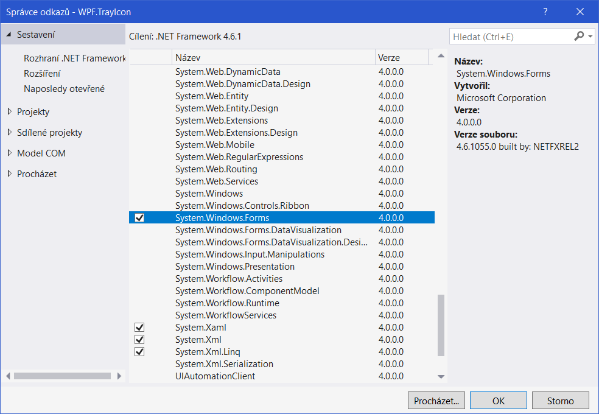
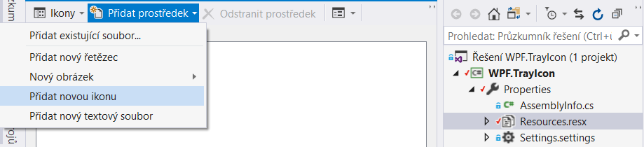

# TrayIcon
WPF aplikace, která pomocí Windows Forms knihovny zobrazuje ikonu běžící aplikace na hlavním panelu operačního systému Windows (vedle hodin).


## Nastavení projektu
Pro využítí Windows Forms ve WPF projektu je potřeba přidat do projektu referenci:



Ikonu je vhodné vložit do projektu jako zdroj (resource) aplikace:



Poté k ní lze přistoupit přímo z kódu:
```csharp
System.Windows.Forms.NotifyIcon _notifyIcon;
_notifyIcon.Icon = TrayIcon.Properties.Resources.Icon;
```
> **TrayIcon** je název namespace, ten je třeba změnit dle aktuálního názvu

## Aplikace 
Podstatou je, že se hlavní okno (MainWindow) aplikace nikdy nezavře, pouze přejde do stavu not Visible.

Následující ukázky jsou všechny ve třídě **App**. V této třídě se také nachází dvě proměnné, které jsou využívány dalšími metodami.
isExit pro kontrolu zavírání okna a notifyIcon slouží jako reference pro ikonu stavového řádku.
```csharp
public partial class App : Application
{
    private bool _isExit;
    private System.Windows.Forms.NotifyIcon _notifyIcon;
...
```

Při spuštění aplikace se nastaví tray icon, její kontextová nabídka a nastaví se pro hlavní aplikační okno event handler (odchycení události) pro událost _Closing_. Poté, kdy je vše nastaveno se zobrazí vybrané okno.

```csharp
protected override void OnStartup(StartupEventArgs e)
{
    base.OnStartup(e);
            
    MainWindow = new SomeWindow();
    MainWindow.Closing += MainWindow_Closing;

    _notifyIcon = new System.Windows.Forms.NotifyIcon();
    _notifyIcon.DoubleClick += (s, args) => ShowMainWindow();
    // Set application icon
    _notifyIcon.Icon = TrayIcon.Properties.Resources.Icon;
    _notifyIcon.Visible = true;

    CreateContextMenu();
    MainWindow.Show();
}
```
> SomeWindow je třída typu Windows.Window (defaultní třída pro okno ve WPF)

Nastavení pro kontextovou nabídku se provede opět pomocí Windows Forms knihovny
```csharp
private void CreateContextMenu()
{
    _notifyIcon.ContextMenuStrip = new System.Windows.Forms.ContextMenuStrip();
    _notifyIcon.ContextMenuStrip.Items.Add("MainWindow...").Click += (s, e) => ShowMainWindow();
    _notifyIcon.ContextMenuStrip.Items.Add("Exit").Click += (s, e) => ExitApplication();
}
```
Metoda, která se provádí při zavírání hlavní aplikačního okna (MainWinow)
```csharp
private void MainWindow_Closing(object sender, CancelEventArgs e)
{
    if (!_isExit)
    {
        e.Cancel = true;
        MainWindow.Hide(); // A hidden window can be shown again, a closed one not
    }
}
```
Poslední dvě metody, které jsou využívány v rámci kontextové nabídky.

Zobrazení okna
```csharp
private void ShowMainWindow()
{
    if (MainWindow.WindowState == WindowState.Minimized)
    {
        MainWindow.WindowState = WindowState.Normal;
        MainWindow.Activate();
                
    }
    else if (!MainWindow.IsVisible)
    {
        MainWindow.Show();
    }
}
```
A ukončení aplikace
```csharp
private void ExitApplication()
{
    _isExit = true;
    MainWindow.Close();
    _notifyIcon.Dispose();
    _notifyIcon = null;
}
```